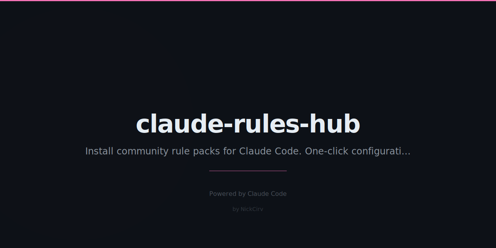

# claude-rules-hub

Community rule packs for Claude Code — one-click install to `.claude/rules/`.

Like ESLint configs but for Claude Code behaviour.



## Install

```bash
npx claude-rules-hub install typescript-strict
```

No config, no API, no sign-up. Rules are bundled — works offline.

## Commands

```bash
# Browse all available packs
npx claude-rules-hub list

# Install a pack to .claude/rules/
npx claude-rules-hub install <name>

# Remove an installed pack
npx claude-rules-hub remove <name>

# Search by name, description, or tag
npx claude-rules-hub search <query>

# Preview pack content
npx claude-rules-hub info <name>

# List only installed packs
npx claude-rules-hub list --installed
```

## Available Packs

| Pack | Description |
|------|-------------|
| `typescript-strict` | Strict TS — no any, immutable patterns, proper error handling |
| `react-best-practices` | Hooks rules, component patterns, state management conventions |
| `python-clean` | PEP 8, type hints, Google docstrings, pytest patterns |
| `security-first` | OWASP top 10, input validation, secret handling, injection prevention |
| `tdd-workflow` | Test-first, red/green/refactor cycle, 80% coverage requirement |
| `api-design` | REST conventions, error responses, pagination, versioning |
| `docs-required` | JSDoc/docstrings on public APIs, README updates, changelog |
| `minimal` | Bare minimum — no debug artifacts, no hardcoded secrets, clean code |

## How It Works

When you install a pack, it copies the rule file to `.claude/rules/<name>.md` in your current project directory.

Claude Code automatically loads all `.md` files in `.claude/rules/` at the start of each session.

```
your-project/
  .claude/
    rules/
      typescript-strict.md   ← installed by claude-rules-hub
      tdd-workflow.md        ← installed by claude-rules-hub
  src/
  package.json
```

## Stack a Combination

```bash
# Recommended starter for TypeScript projects
npx claude-rules-hub install typescript-strict
npx claude-rules-hub install tdd-workflow
npx claude-rules-hub install security-first

# API backend
npx claude-rules-hub install api-design
npx claude-rules-hub install security-first
npx claude-rules-hub install docs-required

# React app
npx claude-rules-hub install react-best-practices
npx claude-rules-hub install typescript-strict
npx claude-rules-hub install minimal
```

## Requirements

- Node.js >= 18
- Claude Code with `.claude/rules/` support

## License

MIT
